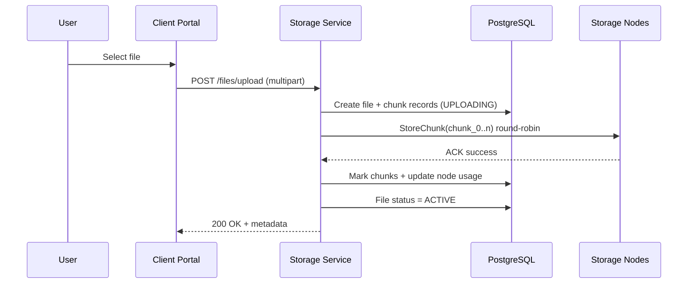
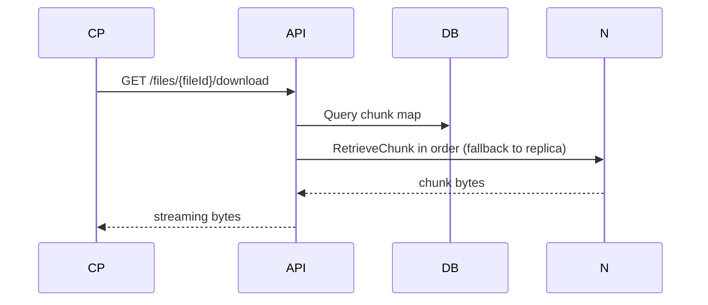
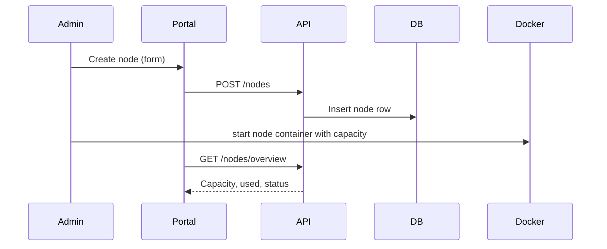

# Component Interaction

## Upload Flow

```mermaid
sequenceDiagram
  participant U as User
  participant CP as Client Portal
  participant API as Storage Service
  participant DB as PostgreSQL
  participant N as Storage Nodes

  U->>CP: Select file
  CP->>API: POST /files/upload (multipart)
  API->>DB: Create file + chunk records (UPLOADING)
  API->>N: StoreChunk(chunk_0..n) round-robin
  N-->>API: ACK success
  API->>DB: Mark chunks + update node usage
  API->>DB: File status = ACTIVE
  API-->>CP: 200 OK + metadata
```

## Download Flow

```mermaid
sequenceDiagram
  CP->>API: GET /files/{fileId}/download
  API->>DB: Query chunk map
  API->>N: RetrieveChunk in order (fallback to replica)
  N-->>API: chunk bytes
  API-->>CP: streaming bytes
```

## Node Management (Admin)

```mermaid
sequenceDiagram
  Admin->>Portal: Create node (form)
  Portal->>API: POST /nodes
  API->>DB: Insert node row
  Admin->>Docker: start node container with capacity
  Portal->>API: GET /nodes/overview
  API-->>Portal: Capacity, used, status
```
