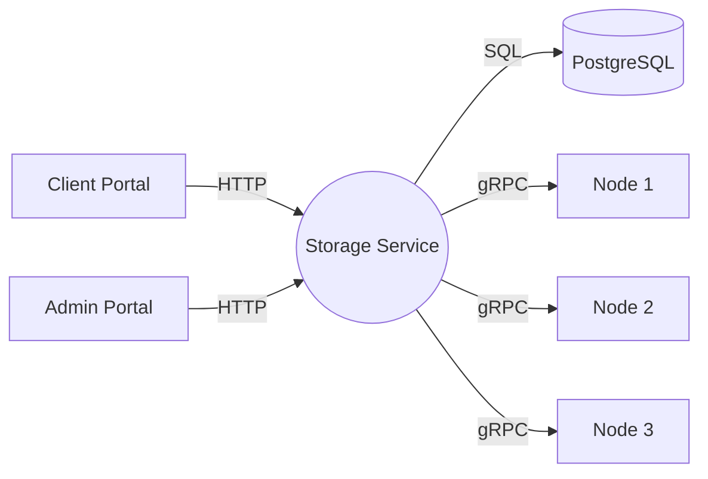

# System Overview

## Services
- Storage Service (FastAPI)
- PostgreSQL (metadata)
- Storage Nodes (gRPC) x3
- Client Portal (React)
- Admin Portal (React)

## High-Level Diagram

## Key Properties
- Chunked storage with optional replication
- Role-based access control
- Node health and overview APIs
- Docker Compose orchestration
