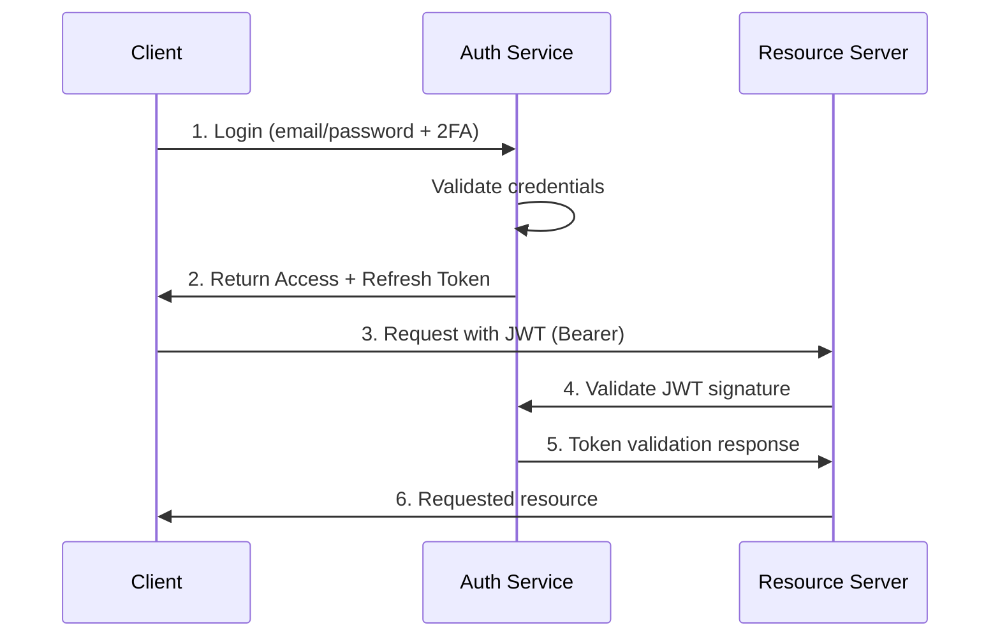

# Authentication & Security

## Overview
This document outlines security architecture and auth mechanisms, focusing on secure remote access and data protection.

Summary:
- Current: JWT (HS256) access tokens stored in localStorage; FastAPI with permissive CORS; no TLS in docker-compose.
- Recommended: RS256 with rotating keys, httpOnly cookies, strict CORS, TLS (reverse proxy), MFA.

## Authentication Flow

### JWT-Based Authentication


## Security Measures

### 1. Token-Based Authentication
- Current
  - JWT (HS256) access tokens saved in localStorage (api.ts).
  - Risk: XSS can exfiltrate token; rotate SECRET_KEY regularly.
- Recommended
  - RS256 (asymmetric signing) with key rotation.
  - Store tokens in secure httpOnly, SameSite=strict cookies.
  - Implement refresh token rotation and blacklist on logout.

### 2. Multi-Factor Authentication
- **Primary Factors**
  - Email/Password
  - OTP via Email/SMS
  - TOTP (Time-based One-Time Password)
- **Secondary Factors**
  - Biometric verification
  - Hardware tokens (YubiKey)
  - IP-based restrictions

### 3. Secure Communication
- Recommended for remote/production
  - TLS 1.2/1.3 via Nginx/Traefik reverse proxy.
  - HSTS enabled in proxy.
  - CORS allow-list frontends only; remove "*".
  - Consider cert pinning for mobile apps.

### 4. Rate Limiting & Throttling
- **IP-based rate limiting**
- **User-based rate limiting**
- **Adaptive throttling** based on behavior

## Remote Access Security

### 1. VPN Integration
- Required for admin access
- Certificate-based authentication
- Network segmentation

### 2. API Gateway Security
- Request validation
- Request signing
- API key rotation

### 3. Data Protection
- **At Rest**: AES-256 encryption
- **In Transit**: TLS 1.3
- **In Use**: Field-level encryption for sensitive data

## Security Headers
```http
Strict-Transport-Security: max-age=63072000; includeSubDomains; preload
X-Content-Type-Options: nosniff
X-Frame-Options: DENY
X-XSS-Protection: 1; mode=block
Content-Security-Policy: default-src 'self';
Referrer-Policy: no-referrer
Permissions-Policy: geolocation=(), microphone=(), camera=()
```

## Session Management

### 1. Session Timeout
- Inactive session: 15 minutes
- Maximum session: 24 hours
- Re-authentication required for sensitive operations

### 2. Concurrent Sessions
- Configurable maximum concurrent sessions
- Session termination on password change
- Device fingerprinting for anomaly detection

## Security Testing

### 1. Automated Scans
- OWASP ZAP for vulnerability scanning
- Dependency checking (OWASP Dependency-Check)
- SAST (Static Application Security Testing)

### 2. Penetration Testing
- Quarterly external pen tests
- Bug bounty program
- Automated security tests in CI/CD

### 3. Compliance
- GDPR compliance
- SOC 2 Type II certification
- Regular security audits

## Incident Response

### 1. Monitoring
- Real-time security event monitoring
- SIEM integration
- Anomaly detection

### 2. Response Plan
- Incident classification
- Containment procedures
- Notification process
- Post-mortem analysis

## Best Practices

### 1. Development
- Secure coding guidelines
- Regular security training
- Code reviews with security focus

### 2. Operations
- Regular security patches
- Least privilege principle
- Regular backup and recovery testing

### 3. Data Protection
- Data minimization
- Regular data purging
- Encryption key rotation

## Remote Auth Security Checklist
1. Put storage-service behind HTTPS reverse proxy (Nginx/Traefik) with valid certs.
2. Set CORS allow_origins to frontend domain(s) only.
3. Switch to RS256 and store tokens in httpOnly cookies; rotate keys.
4. Enforce MFA for admins; consider for all users.
5. Implement rate limiters, CAPTCHA on auth endpoints under attack.
6. Enable security headers at proxy and app levels.
7. Audit and rotate secrets; remove default/dev secrets from compose.

## Future Enhancements
1. Implement zero-trust architecture
2. Add hardware security module (HSM) integration
3. Enhance biometric authentication
4. Implement confidential computing for sensitive operations
5. Add quantum-resistant cryptography
