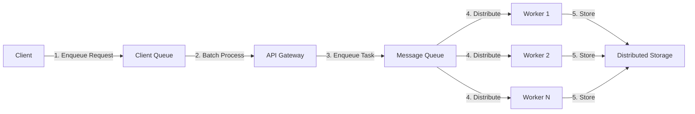

# Message Queue System

## Overview
This document explains our design choices for message communication under high concurrency.

Current state:
- Synchronous, in-process processing in the API for uploads and chunking.
- Round-robin node selection; optional replication factor.
- No external broker (e.g., RabbitMQ) is running yet.

Proposed improvements:
- Introduce a broker-backed work queue (RabbitMQ) for server-side jobs.
- Add a lightweight client-side queue for batching/retries when the network is flaky.

## Architecture

### Components
1. **Client-Side Queue (Proposed)**
   - Request batching, retries with exponential backoff
   - Optional offline buffering (IndexedDB)
   - Backpressure based on server hints

2. **Server-Side Queue (Proposed)**
   - RabbitMQ durable queues for uploads and background jobs
   - Priority queues and dead-letter queues (DLQ)
   - Workers scale horizontally to process jobs

### Message Flow


## Implementation Details

### Client-Side Queue
- Current: Not implemented.
- Proposed: IndexedDB + Web Worker for batching and retry with exponential backoff.

### Server-Side Queue
- Current: None. Uploads are handled synchronously in FastAPI; chunks are sent directly to nodes using round-robin.
- Proposed: RabbitMQ (AMQP) durable queues; DLQ; TTL; priority; worker autoscaling.

### Message Format
```typescript
interface QueueMessage<T = any> {
  id: string;
  type: 'STORAGE_UPLOAD' | 'FILE_PROCESSING' | 'NOTIFICATION';
  priority: number; // 1-10, 10 being highest
  payload: T;
  retryCount: number;
  maxRetries: number;
  createdAt: string;
  metadata: {
    userId: string;
    sessionId?: string;
    deviceInfo?: DeviceInfo;
  };
}
```

## Performance Considerations

### Throughput
- Targets (to be validated): 5k–10k messages/sec per queue depending on payload size and worker count.

### Latency
- Goals: avg < 100ms; p95 < 300ms; p99 < 800ms under steady load.

### Reliability
- At-least-once delivery with idempotent job handling.
- DLQ for poison messages; alert on DLQ growth.

## Scaling Strategy

### Horizontal Scaling
- Workers scale with queue depth; shard by routing key (e.g., userId hash).

### Load Balancing
- Weighted routing; circuit breakers and retries with jitter.

## Monitoring and Alerting

### Metrics Collected
- Queue depth over time
- Processing time per message
- Error rates and types
- Worker node utilization

### Alerting Rules
- Queue depth threshold exceeded
- High error rate (> 5%)
- Worker node failure
- Message age threshold

## Verification & Tests

### Load Test (example plan)
- Tooling: k6 or Locust.
- Scenario: 500–2,000 VUs upload 5–50 MB files; ramp-up 5m, steady 10m.
- KPIs: success rate, avg/p95/p99 latency, queue depth (if broker enabled), node utilization.

### Failure Recovery (when broker is added)
- Kill one worker; verify jobs re-queued and processed by others.
- Simulate node outage; verify replicas support reads; measure recovery time.

## Future Improvements
1. Introduce RabbitMQ-backed queues for uploads and background jobs.
2. Add idempotency keys and exactly-once-like semantics at application level.
3. Stream processing (Kafka) for real-time analytics of usage metrics.
4. ML-based anomaly detection for queue and node metrics.
